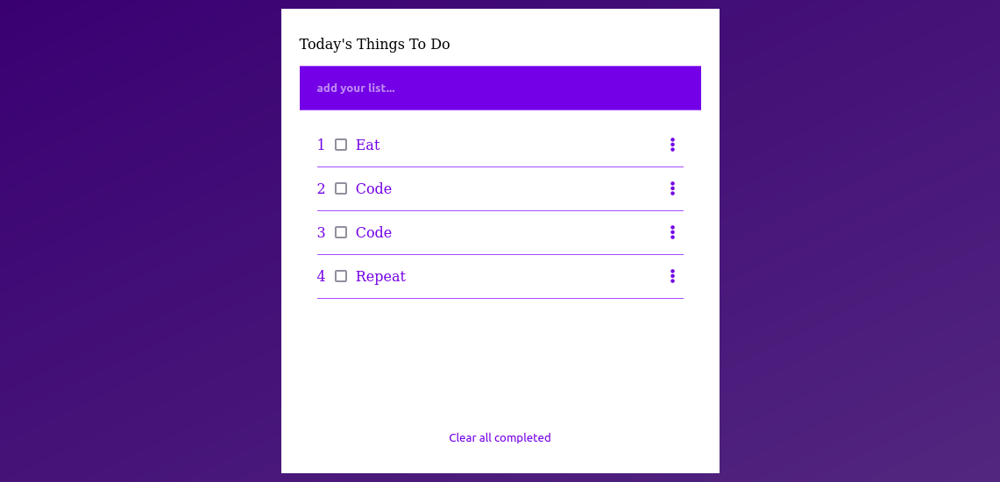

# To-do-list_App
This project is a simple to do app that allows you to be organized with your dayly tasks

- See live version [here](https://marcraphael12.github.io/To-do-list_App/dist/)

## Built With

- Major languages : HTML/CSS, JavaScript;
- IDE : VisualStudio Code, Atom;
- Web Browsers : Firefox, Google Chrome;
- Server : Webpack;

### Testing

- Microverse Linters
- [W3C validator](https://validator.w3.org/)
- Web Browsers

## Getting Started

To get a local copy up and running follow these simple example steps.

### Prerequisites

- Web browser (choose what you prefered)
- Code editor **for developers only

### Setup

- Download the repo, if you don't know how to do it, just [click here](https://github.com/Marcraphael12/To-do-list_App/archive/refs/heads/main.zip)!
- Open the ./src/index file with your browser, and enjoy!
- Or in the folder, open a new terminal, run <code>npm start</code>. If you do'nt have npm installed, follow [this guide](https://webpack.js.org/guides/development/#using-webpack-dev-server)

### Install

- No need to install something!

<!-- ## Live Demo

[Have a detailed view by clicking here](https://marcraphael12.github.io/Marc-first-capstone) -->

### Author
👤 **Marc Raphael**

- GitHub: [@Marcraphael12](https://github.com/Marcraphael12)
- LinkedIn: [Marc_Raphael](www.linkedin.com/in/marc-raphael-326039204)

## 🤝 Contributing

Contributions, issues, and feature requests are welcome!

Feel free to check the [issues page](https://github.com/Marcraphael12/To-do-list_App/issues).

## Show your support

Give a ⭐️ if you like this project!

<!-- ## Acknowledgments
- -->
